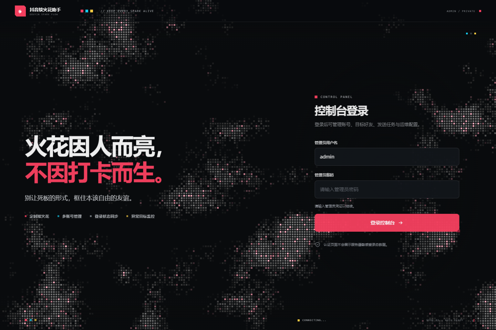
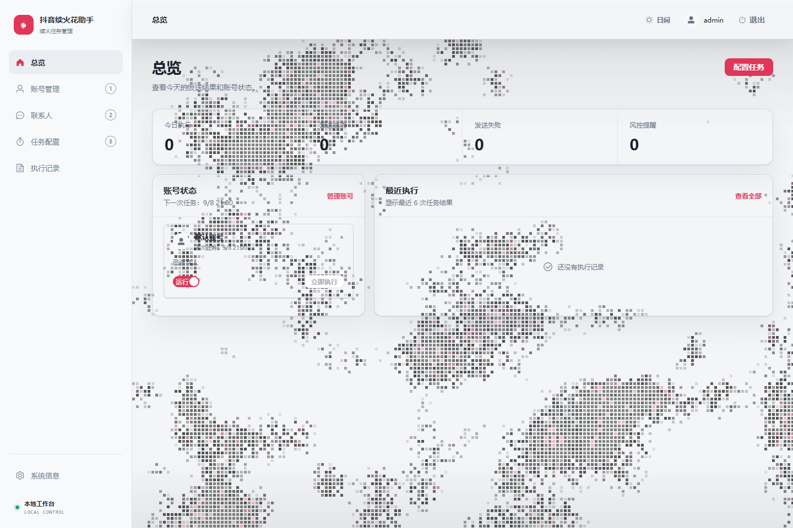
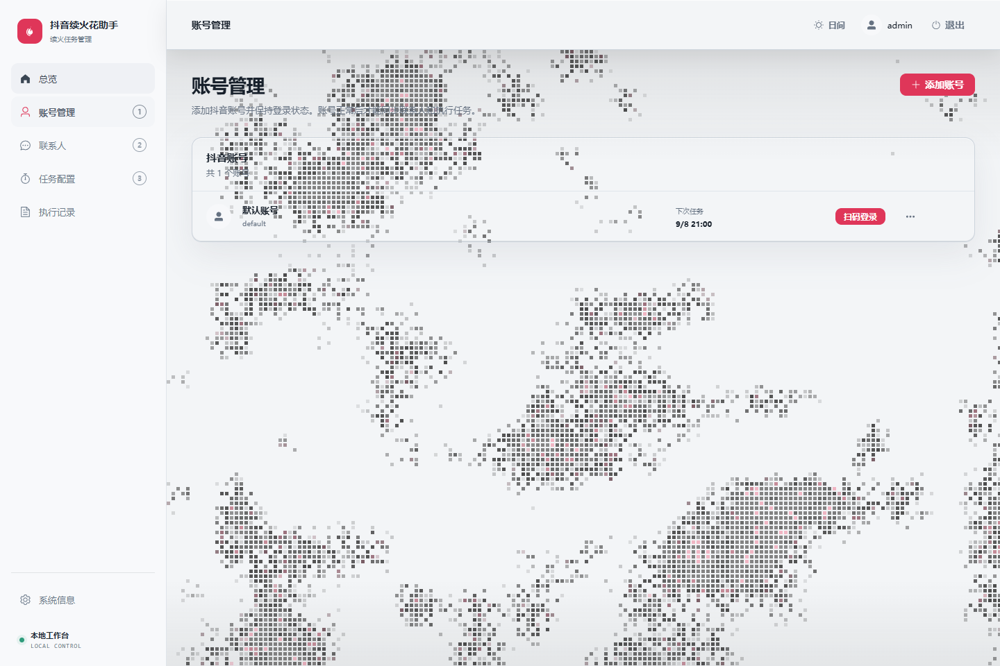
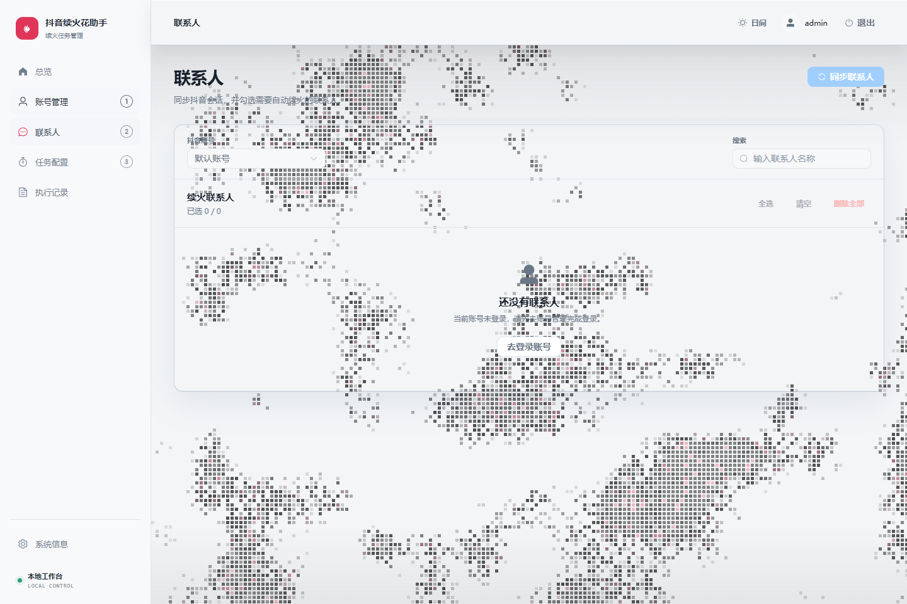
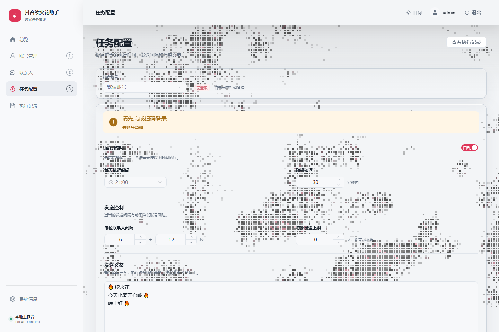

# 抖音续火花助手

一个面向自用场景的抖音私信续火管理后台。它将账号、联系人、任务配置和执行记录集中到网页控制台，帮助你先确认任务，再按计划执行。

> 本项目依赖抖音网页端、登录状态和平台风控策略。请先用小号完成 Dry Run；不要将它用于违反平台规则、批量营销或干扰他人的场景。

## 界面预览

### 控制台登录



### 账号、联系人与任务

| 总览 | 账号管理 |
| --- | --- |
|  |  |

| 联系人管理 | 任务配置 |
| --- | --- |
|  |  |

截图来自隔离演示环境，不包含真实账号、联系人、二维码或登录态。

## 你可以做什么

- 管理多个账号；每个账号的登录态、联系人、任务配置和运行数据彼此隔离。
- 在网页中发起或取消扫码登录，并检查登录状态。
- 同步联系人、补充未完成的扫描、选择目标，以及清理不再需要的联系人。
- 配置每日时间、随机延迟、发送间隔、单次上限和候选消息；支持 Dry Run、立即执行、停止和自动执行开关。
- 查看总览、任务历史和执行明细；通过健康检查确认数据库和调度器状态。

## 最短成功路径：从 GitHub 拉取并启动

这是新用户最推荐的方式：从源码构建 Docker 镜像。它不依赖本项目维护者的服务器、域名、宝塔面板或 GHCR 镜像权限。

### 准备条件

- Git
- Docker Engine 与 Docker Compose v2
- 一台可运行 Docker 的电脑或 Linux 服务器

首次构建会下载 Python、Node.js 和 Playwright Chromium 依赖，耗时取决于网络环境。不要在构建中途关闭终端。

### 1. 克隆项目

```bash
git clone https://github.com/youge12388-create/tiktok-fire.git
cd tiktok-fire
```

### 2. 创建私密配置

Linux/macOS：

```bash
cp .env.example .env
```

Windows PowerShell：

```powershell
Copy-Item .env.example .env
```

打开 `.env`，至少填写下面四项：

```dotenv
ADMIN_USERNAME=admin
ADMIN_PASSWORD=请设置一个强密码
SESSION_SECRET=请设置至少32位随机字符串
COOKIE_SECURE=false
```

`.env`、`data/`、Cookie 和二维码都属于私密数据，不能提交或发送到公开仓库。使用 HTTPS 反向代理时，再把 `COOKIE_SECURE` 改为 `true`。

### 3. 构建并启动

```bash
docker compose up -d --build
docker compose ps
```

`compose.yml` 默认只把服务绑定在本机 `127.0.0.1:8011`，这是为了避免把管理后台直接暴露到公网。

### 4. 检查服务并登录

```bash
curl http://127.0.0.1:8011/api/v1/system/health
```

返回 `"ok": true` 后，在部署机器上打开：

```text
http://127.0.0.1:8011
```

使用刚才写入 `.env` 的管理员账号和密码登录。然后按“账号管理 → 扫码登录 → 联系人 → 任务配置 → Dry Run → 自动执行”的顺序完成首次设置。

如果应用部署在远程服务器，不能直接通过公网 IP 访问该端口；请继续完成 [服务器部署与排障指南](docs/deployment.md) 中的 Nginx/HTTPS 步骤。

## 部署、升级与排障

- [服务器部署与排障指南](docs/deployment.md)：适合第一次在 Linux 服务器部署、配置 Nginx/HTTPS、升级和回滚。
- [可选的 GHCR 镜像发布说明](deploy/ghcr-deployment.md)：只面向维护者或希望自行维护 GitHub Actions 与镜像仓库的用户。
- [Nginx 根路径示例](deploy/nginx-example.conf) 与 [子路径示例](deploy/nginx-subpath-example.conf)：按自己的域名和证书路径修改后使用。

## 本地开发

后端：

```powershell
python -m venv .venv
.\.venv\Scripts\python.exe -m pip install -r requirements.txt
.\.venv\Scripts\python.exe app.py
```

前端（另开一个终端）：

```powershell
Set-Location frontend
npm install
npm run dev
```

浏览器打开 `http://127.0.0.1:5173`；开发服务器会将 `/api` 代理到后端 `127.0.0.1:8000`。

## 验证

```powershell
.\.venv\Scripts\python.exe -m pytest -q
.\.venv\Scripts\python.exe -m compileall app.py api core db services
Set-Location frontend
npm run typecheck
npm run build
```

## 项目结构

| 路径 | 说明 |
| --- | --- |
| `app.py` | FastAPI 应用入口、生命周期和静态页面服务 |
| `api/` | 认证、账号、联系人、任务、运行记录和系统接口 |
| `services/` | 业务编排、任务运行与状态管理 |
| `core/` | 浏览器自动化、登录会话、调度和联系人台账 |
| `db/` | SQLite 初始化与运行记录仓储 |
| `frontend/` | Vue 3 管理后台 |
| `deploy/` | Nginx、可选 GHCR 与传统部署辅助文件 |
| `docs/` | 用户文档、验收说明和部署指南 |
| `tests/` | 后端回归测试 |

## 使用边界

- 抖音页面、Cookie 生命周期和风控规则可能变化；外部平台异常都应由使用者人工确认。
- 本项目不提供绕过验证码、人脸校验或平台安全策略的能力。
- 首次使用、账号异常和平台页面改版后，都应先以小号执行 Dry Run，再决定是否恢复自动任务。
